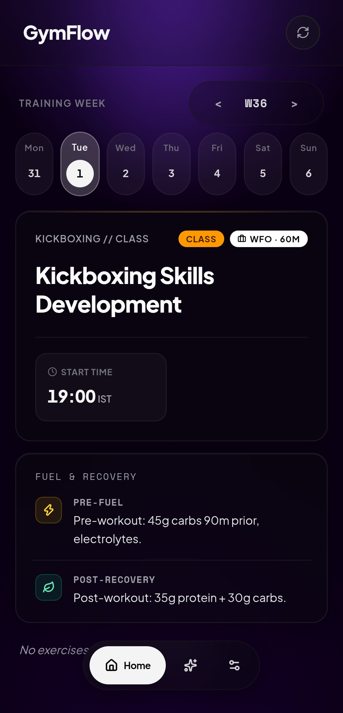
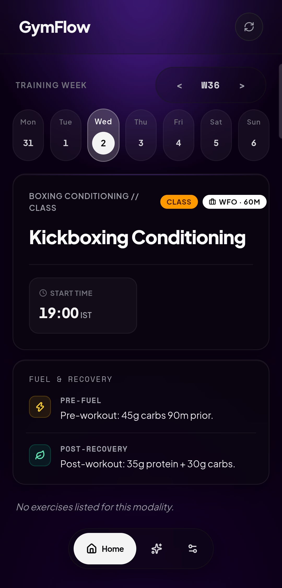
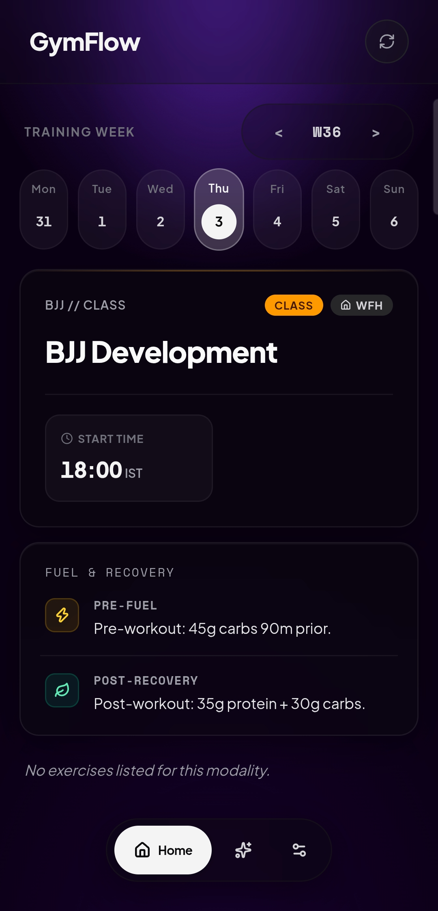
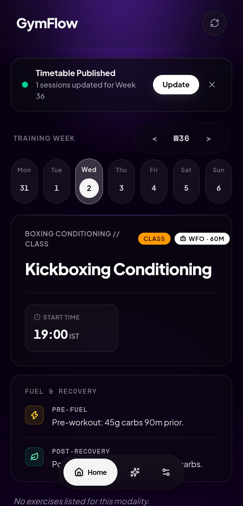
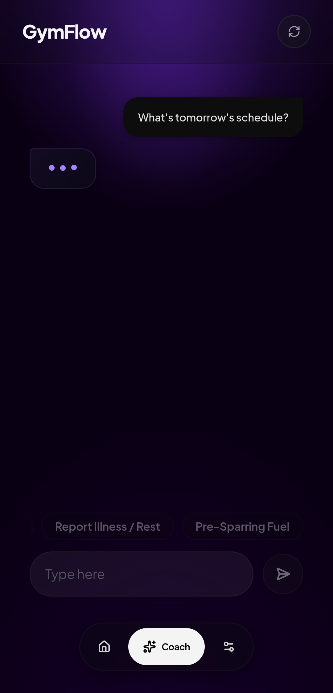
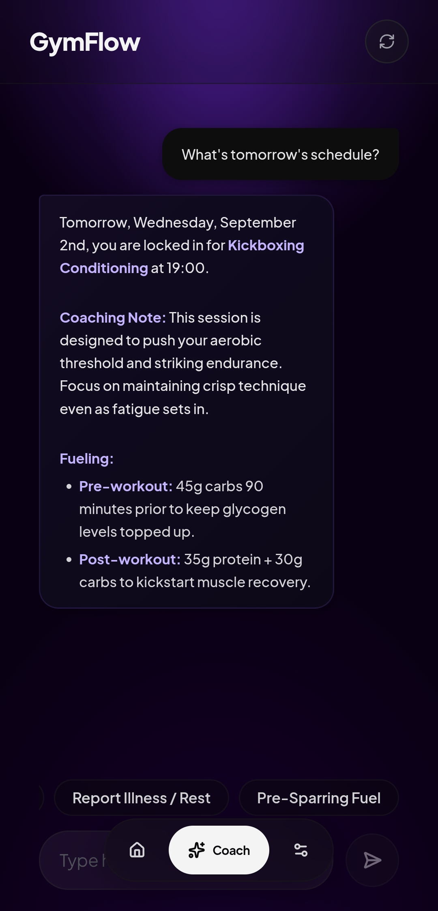
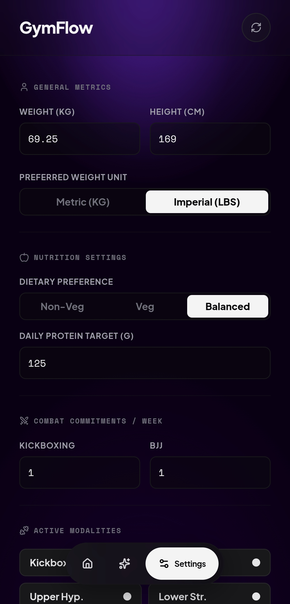
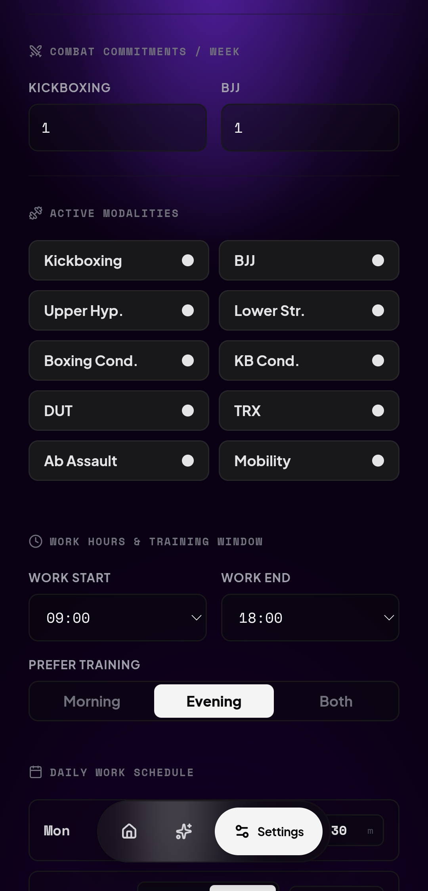

# GymFlow 🥊

I built GymFlow because my gym's class schedule kept changing mid-week and I was tired of manually rearranging my training around it. It syncs live with my gym's scheduling API, detects class cancellations, and uses an LLM agent to replan my week around real-world constraints — Work From Office (WFO) commute shifts, systemic fatigue, nutrition, and combat sports sessions (Kickboxing, BJJ). I use it every day.

The repo is open source. You won't be able to connect it to my gym's API (it's behind private membership auth), but you can run it fully locally with mock fixtures using `GYM_USE_MOCK=true` — all AI replanning, schedule diffing, and coaching workflows work identically.

---

## 📱 Screenshots

### 📅 Adaptive Weekly Schedule & Live Sync
| Kickboxing Skills (WFO 60M) | Boxing Conditioning (WFO) |
| :---: | :---: |
|  |  |

| BJJ Development (WFH) | Live Timetable Update Notification |
| :---: | :---: |
|  |  |

### 🤖 AI Coach Assistant & Dynamic Replanning
| Interactive Coach Chat | Contextual Advice & Fueling Strategy |
| :---: | :---: |
|  |  |

### ⚙️ User Constraints & Modality Settings
| Biometrics & Nutrition Settings | Modalities & Training Windows |
| :---: | :---: |
|  |  |

---

## ⚡ Key Highlights & Architecture

- **Reverse-Engineered Third-Party Ingestion:** Secure backend OTP authentication bridge with 24-hour token delegation into Upstash Redis (zero token leakage to the client).
- **Dynamic Mid-Week Schedule Diffing:** Ingests live timetable endpoints, compares against weekly Redis state snapshots, and alerts the context engine to slot cancellations.
- **Stateful Agentic Replanning:** Implements deterministic tool calling (`replan_week_schedule`, `log_constraint`) via Gemini Pro/Flash rather than brittle text generation.
- **Spec-Driven & Zero-Cost Serverless:** Engineered entirely on Next.js 15 App Router, TypeScript strict mode, Zod boundary enforcement, and serverless edge compute ($0/mo operating footprint).
- **Offline Mock Adapter:** Full local testability and public demo support using sanitized JSON fixtures (`GYM_USE_MOCK=true`).

---

## 🏗️ System Architecture

```text
[ Next.js 15 App Router (Frontend UI + Edge API) ]
                 │
                 ▼ (HttpOnly Session)
┌──────────────────────────────────────────────────────────────┐
│ BACKEND SERVICES & ORCHESTRATION                             │
├──────────────────────────────────────────────────────────────┤
│ 1. Auth Bridge       ──► Proxies OTP / Exchanges Bearer JWT  │
│ 2. Gym Ingestion     ──► Fetches /member/schedules/by-tier   │
│ 3. Diff Engine       ──► Detects mid-week class shifts       │
│ 4. Agent Tool Runner ──► Executes structured LLM tool calls  │
└──────────────┬───────────────────────────────┬───────────────┘
               │                               │
               ▼                               ▼
     [ Upstash Redis ]               [ Google GenAI SDK ]
  (Tokens, Cache, Snapshots)         (Gemini 2.5/3 Pro & Flash)
```

---

## 🛠️ Tech Stack

- **Framework:** Next.js 15 (App Router, React Server Components)
- **Language:** TypeScript (Strict Mode, zero `any`)
- **State & Caching:** Upstash Redis (REST-based edge client)
- **AI Orchestration:** Google GenAI SDK (Structured Outputs & Tool Calling)
- **Validation:** Zod (Runtime boundary enforcement)
- **Styling:** Tailwind CSS

---

## 📁 Repository Structure

```text
.
├── AGENTS.md                  # Project rules & constraints for AI coding agents
├── fixtures/                  # Sanitized mock JSON payloads for offline dev & CI
│   ├── raw-auth-response.json
│   └── raw-schedules-response.json
├── specs/                     # Spec-Driven Development (SDD) architectural blueprints
│   ├── 01-contracts.md
│   ├── 02-auth-and-client.md
│   ├── 03-schedule-ingest.md
│   └── 04-agent-engine.md
├── evals/                     # Deterministic LLM evaluation scenarios & test harness
│   └── test-scenarios.json
├── src/
│   ├── app/                   # Next.js App Router pages and API routes
│   ├── lib/                   # Gym client adapters, Redis cache, agent tools
│   └── types/                 # Zod schemas and TypeScript data contracts
└── scripts/                   # Evaluation runners and test scripts
```

---

## 🚀 Getting Started

### 1. Clone & Install
```bash
git clone https://github.com/your-username/gymflow.git
cd gymflow
npm install
```

### 2. Configure Environment Variables
Copy `.env.example` to `.env.local`:
```bash
cp .env.example .env.local
```

Fill in the required credentials:
```env
# Gym Provider Configuration (Use mock mode for offline dev)
GYM_USE_MOCK=true
GYM_API_BASE_URL="https://api.your-gym-provider.com"

# Upstash Redis
UPSTASH_REDIS_REST_URL="https://your-redis-instance.upstash.io"
UPSTASH_REDIS_REST_TOKEN="your_redis_token"

# LLM Provider Configuration
LLM_PROVIDER="openai" # or "gemini"
LLM_MODEL="google/gemini-2.5-flash"
LLM_API_KEY="your_llm_api_key"
LLM_BASE_URL="https://openrouter.ai/api/v1" # if using OpenAI-compatible providers like OpenRouter

# App Security
SESSION_JWT_SECRET="generate_a_random_32_byte_secret"
```

### 3. Run Locally
```bash
npm run dev
```
Open `http://localhost:3000` to interact with the coaching copilot.

---

## 🧪 Running Agent Evals
To evaluate the LLM's dynamic replanning logic against deterministic test cases:
```bash
npm run eval
```

---

## 📄 License
MIT